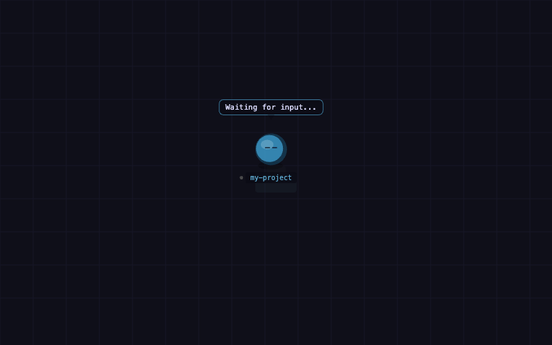
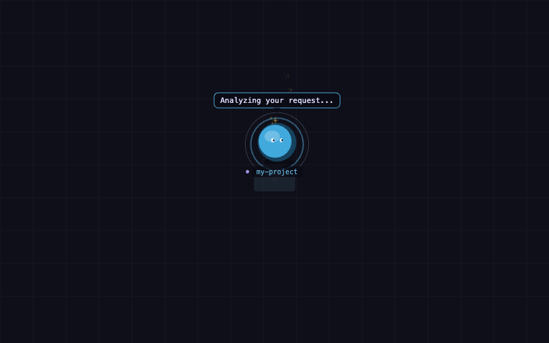
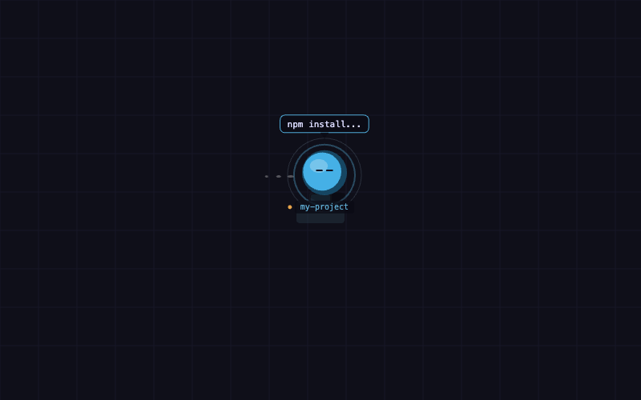
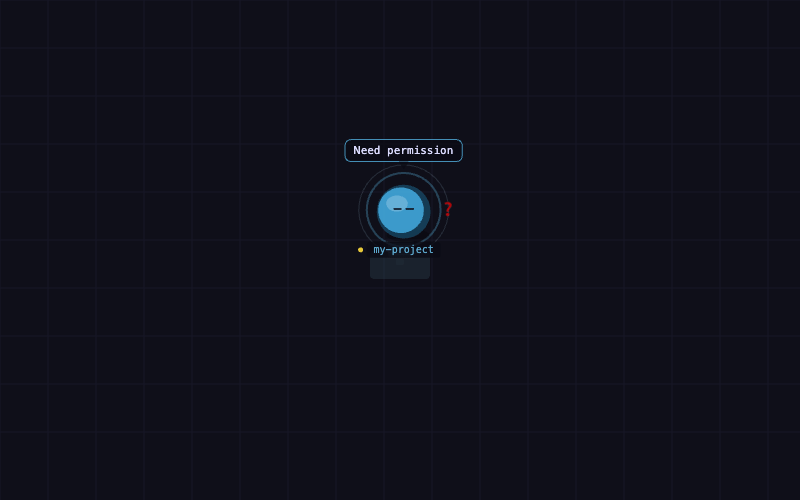
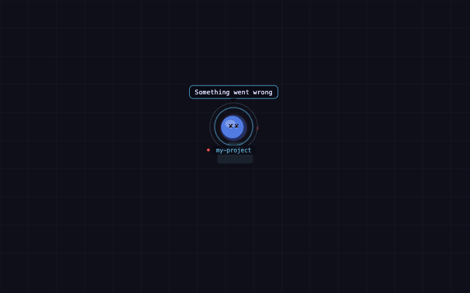
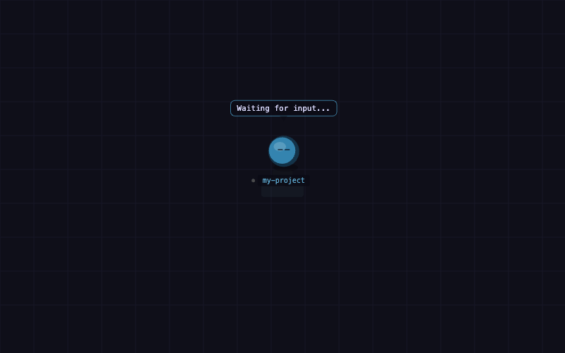
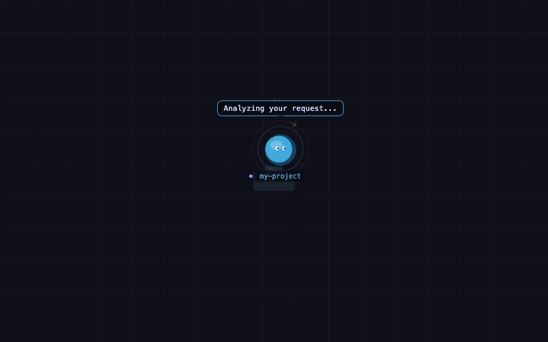
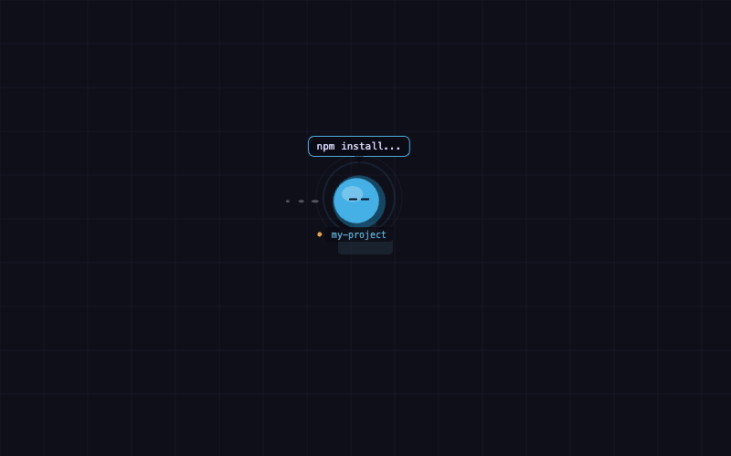
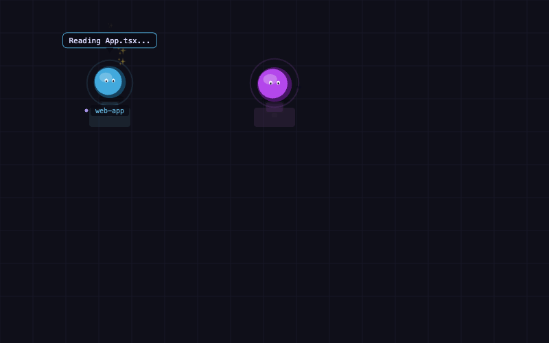

# 🏢 Pixel Office — Watch Your AI Work in a Tiny Virtual Office

**Ever wondered what your AI coding assistant is up to across all your projects? Now you can watch!**

Pixel Office is a fun, visual way to see what OpenCode is doing in real-time. Think of it as a tiny virtual office where each of your AI sessions gets its own desk, complete with a character, a name tag, and speech bubbles showing what it's thinking.

---

## ✨ What You'll See

Imagine a cozy pixel-art office with:

- **Cute colored blobs** — one for each OpenCode session, each with its own color so you can tell them apart
- **Name tags** — shows which project folder that session is working on
- **Speech bubbles** — displays what the AI is currently doing (reading a file, writing code, running a command...)
- **Little desks** — each agent has a desk with a monitor that glows when it's working
- **Animations** — the blobs gently bob around when thinking, and pulse quickly when actively editing

It's honestly just satisfying to watch. Like a digital pet, but more useful.

---

## 📸 See It In Action

Here's what the different agent statuses look like:

### Single Agent Statuses

| Status      | Preview                                  |
| ----------- | ---------------------------------------- |
| 💤 Idle     |          |
| 🧠 Thinking |  |
| 📖 Reading  |    |
| ✏️ Editing  |    |
| 💻 Running  |    |
| ⚠️ Waiting  |    |
| ❌ Error    |        |

### Status Transitions

| Transition         | Preview                                                        |
| ------------------ | -------------------------------------------------------------- |
| Idle → Thinking    |        |
| Thinking → Editing |  |
| Editing → Running  |    |
| Running → Idle     |          |

### Multi-Agent View

Working on multiple projects at once? Here's what it looks like with 4 agents:



---

## 🎨 What the Status Colors Mean

On each name tag, there's a small colored dot that tells you what the AI is up to:

| Status      | Color  | Meaning                           |
| ----------- | ------ | --------------------------------- |
| 💤 Idle     | Grey   | Waiting for you to say something  |
| 🧠 Thinking | Purple | Working on a response             |
| ✏️ Editing  | Green  | Writing or changing files         |
| 📖 Reading  | Blue   | Looking at your code              |
| 💻 Running  | Orange | Running terminal commands         |
| ⚠️ Waiting  | Yellow | Needs your permission to continue |
| ❌ Error    | Red    | Something went wrong              |

---

## 🚀 Quick Install (3 Steps)

1. **Clone this repo**

   ```bash
   git clone <this-repo>
   cd pixel-office
   ```

2. **Run the install script**

   ```bash
   bash install.sh
   ```

3. **Restart OpenCode** — and you're done!

The viewer will automatically open in your browser on your first session. That's it!

---

## 🔧 Manual Install (if the script doesn't work for you)

```bash
# Create the plugins folder if it doesn't exist
mkdir -p ~/.config/opencode/plugins

# Copy the files over
cp pixel-office.ts  ~/.config/opencode/plugins/
cp pixel-office.html ~/.config/opencode/plugins/
cp package.json     ~/.config/opencode/plugins/
```

Then add this to your `~/.config/opencode/opencode.json`:

```json
{
  "$schema": "https://opencode.ai/config.json"
}
```

(If you're not sure what any of this means, just try the 3-step install above first!)

---

## 💡 Why Use This?

- **Multi-project overview** — If you're like most developers and have 5+ projects on the go, you can see all your AI sessions at once
- **At-a-glance status** — No more wondering "is it thinking or stuck?" — just glance at the color
- **It's fun** — Honestly, watching your little AI workers bop around is genuinely satisfying
- **Zero config** — Works out of the box, no settings to tweak

---

## Making It Your Own

Want to customize the look? The whole visual rendering is in one place — easy to swap out:

1. Find a pixel-art sprite sheet you like (free ones on itch.io work great)
2. Load it in the code
3. Replace the blob drawing with your sprites
4. Use the status to pick different animation frames

## The entire rendering lives in the `draw()` function — it's surprisingly easy to modify.

## How It Works (Technical)

If you're curious about the magic behind the scenes:

```
OpenCode (any session)
  └── pixel-office.ts plugin
        ├── Listens to session events (created, deleted, status changes)
        │          tool executions, messages, permissions
        └── Sends updates to browser via WebSocket → ws://localhost:2727
              └── pixel-office.html (the visual viewer)
                    opens automatically in your browser
```

The plugin taps into OpenCode's built-in event hooks — no file watching, no polling, no messing with OpenCode itself.

---

## Related Projects by Others

I saw [Pixel Agents](https://github.com/pablodelucca/pixel-agents) by pablodelucca, and was very inspired. It does the same kind of visualisation with pixel art but as a VS Code plugin for Claude Code. This is my HTML CSS-only take on it, for OpenCode.

---

## Troubleshooting

**Viewer doesn't open automatically?**
No worries — just open `~/.config/opencode/plugins/pixel-office.html` in your browser manually.

**Port 2727 is already in use?**
Change `PORT = 2727` in `pixel-office.ts` and update the `WS_URL` in `pixel-office.html`.

**No agents appearing?**

- Make sure OpenCode loaded the plugin — look for `[pixel-office]` in your logs
- Run `bun install` in the plugin folder, then restart OpenCode
- Open the browser console (F12) on the viewer page to check for errors

## Support This Project

If you find this little plugin useful, I'd truly appreciate your support. Please consider buying me a coffee on [Ko-fi](https://ko-fi.com/pamelawang_mwahacookie). Your contribution helps me keep making tools that make your creative life easier.

## A Note on OpenCode

Just to be clear — this is a plugin I built for OpenCode, but it's not made by the [OpenCode](https://github.com/anomalyco/opencode) team and I am not affliated with them.
