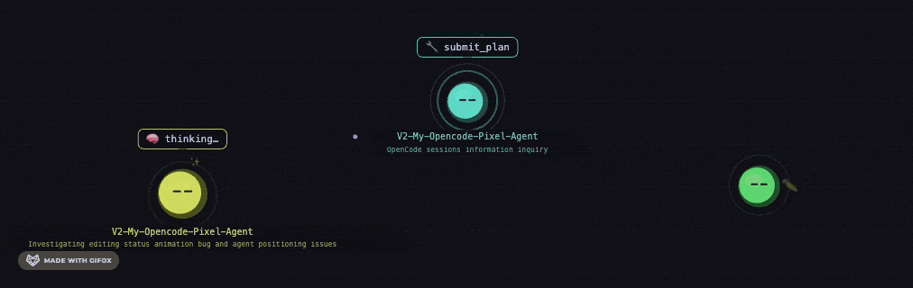

# 🏢 Pixel Office



OpenCode plugin for visualizing AI coding sessions in a virtual office workspace.


Pixel Office creates a blob character visualization of your coding sessions. Each session appears as a colored agent with speech bubbles showing current status and activity. Subagents show as smaller blobs orbitting their parents.


---

## Installation (One-Liner)

```bash
bash -c "$(curl -fsSL https://raw.githubusercontent.com/Caffa/Session-Character-Visualizer/main/install.sh)"
```

Or manually:

```bash
git clone https://github.com/Caffa/Session-Character-Visualizer.git
cd Session-Character-Visualizer
bash install.sh
```

Restart OpenCode. The viewer opens automatically in your browser.

---

## Quick Start

```bash
# Install with one-liner
bash -c "$(curl -fsSL https://raw.githubusercontent.com/Caffa/Session-Character-Visualizer/main/install.sh)"

# Restart OpenCode
opencode --restart

# Open the viewer
open ~/.config/opencode/plugins/pixel-office.html
```

---

## Agent States

| State    | Color  | Description         |
| -------- | ------ | ------------------- |
| Idle     | Grey   | Waiting for input   |
| Thinking | Purple | Processing response |
| Editing  | Green  | Writing files       |
| Reading  | Blue   | Reading code        |
| Running  | Orange | Executing commands  |
| Waiting  | Yellow | Requires permission |
| Error    | Red    | Error occurred      |

---

## Architecture

```
pixel-office.ts (OpenCode plugin)
  ├─ Session events: created, deleted, status changes
  ├─ Tool executions: read, edit, bash, webfetch
  └─ WebSocket server: ws://localhost:2727
       └─ pixel-office.html (p5.js renderer)
            ├─ Radial agent positioning
            └─ Status-based animations
```

### Technical

- WebSocket on port 2727
- Event-driven updates from OpenCode hooks
- p5.js canvas rendering
- No bundling required

---

## Configuration

Change WebSocket port in:

1. `pixel-office.ts`: `PORT = 2727`
2. `pixel-office.html`: `WS_URL`

---

## Development

### Run Tests

```bash
bun test
```

### Regenerate Preview GIFs

```bash
cd media-previews
./START.sh
```

**Requirements**: macOS, ffmpeg (`brew install ffmpeg`)

---

## Troubleshooting

**Viewer doesn't open**: Open `~/.config/opencode/plugins/pixel-office.html` manually

**Port 2727 in use**: Change port in `pixel-office.ts` and `pixel-office.html`

**No agents appearing**:

1. Check OpenCode logs for `[pixel-office]` prefix
2. Run `bun install` in plugin folder
3. Open browser console on viewer page

---

## License

MIT License - see LICENSE file.

---

## About

Pixel Office is a community plugin for [OpenCode](https://github.com/anomalyco/opencode), not affiliated with the OpenCode team.
